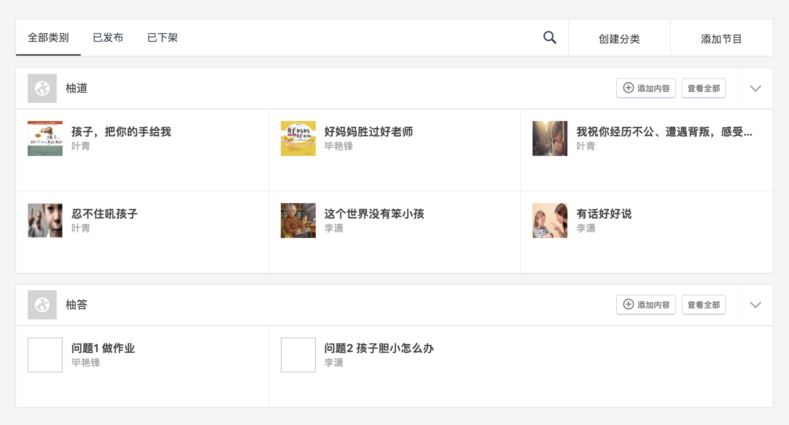

```grid|2|My super images!


```


This page has front matter that should be parsed before the sections.


This is an excerpt.
---

---aaa

title: First section
---

Section one.

---bbb
title: Second section
---

Part 1.

---

Part 2.

---

Part 3.

---ccc
title: Third section
---

Section three.
