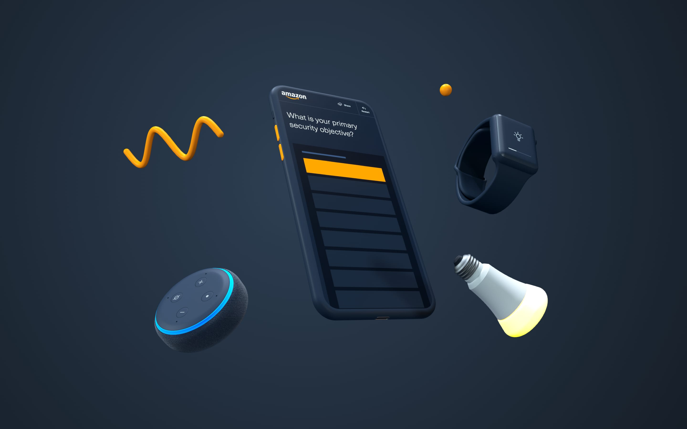

```grid|2|My super images!


```


This page has front matter that should be parsed before the sections.


This is an excerpt.
---

---Introduction
title: First
type: text
---

Section one.
---

News and media has truly become a mobile platform, with **58%** of adults getting news on a mobile device1.
Mobile as the medium for news is more important 

---Execution
title: Second section
---

Part 1.

---

Part 2.
---

Part 3.

---stats
title: Third section
---
Section three.
